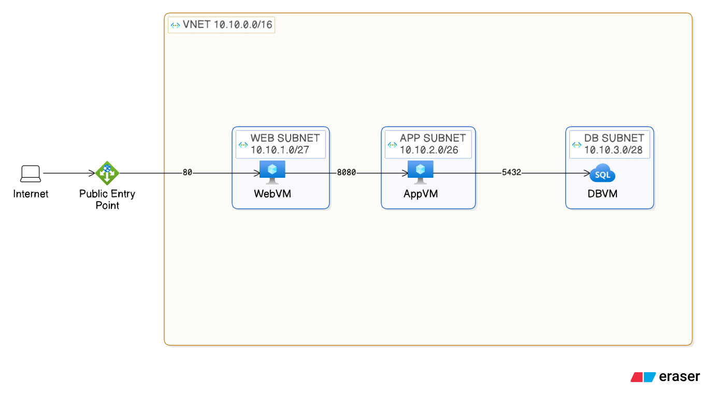

# RouteWell — Secure 3-Tier Azure Architecture

## Scenario

RouteWell ran its entire stack — frontend, backend, and database — inside a single flat network. A developer's laptop nearly exposed the production database to the internet. This project redesigns RouteWell's infrastructure from scratch: the website stays reachable from the internet, the database never is, only the minimum required ports are open, and the whole thing can be torn down and rebuilt on command.

## Architecture

```
Internet
   │
   ▼
Application Gateway (WAF_v2) ── public IP, subnet-appgw
   │  :80
   ▼
Web VM ── subnet-web (10.123.1.0/27)
   │  :8080
   ▼
App VM ── subnet-app (10.123.2.0/26)
   │  :5432
   ▼
DB VM ── subnet-db (10.123.3.0/28)
```

Traffic only ever moves one direction, one hop at a time. Nothing skips a tier, and nothing reaches the database subnet from outside the app tier. A NAT Gateway gives the app and db subnets outbound-only internet access (for patching, package installs) without ever exposing them to inbound traffic.

Full diagram: 

<details>
<summary>Eraser diagram-as-code (click to expand)</summary>

```
textSize large
title Routewell architecture
// RouteWell network architecture

Internet [icon: laptop]

Public Entry Point [icon: azure-application-gateway]

"VNet 10.10.0.0/16" [icon: azure-virtual-networks] {
  "Web Subnet 10.10.1.0/27" [icon: azure-subnet] {
    WebVM [icon: azure-virtual-machine]
  }
  "App Subnet 10.10.2.0/26" [icon: azure-subnet] {
    AppVM [icon: azure-virtual-machine]
  }
  "DB Subnet 10.10.3.0/28" [icon: azure-subnet] {
    DBVM [icon: azure-sql]
  }
}

// Connections
Internet > Public Entry Point
Public Entry Point > WebVM: 80
WebVM > AppVM: 8080
AppVM > DBVM: 5432
```

Use this on [Eraser](https://app.eraser.io) to regenerate the diagram.
</details>

## Design decisions

### CIDR planning

Sized to actual host counts rather than defaulting to `/24` everywhere:

| Subnet | CIDR | Usable hosts | Why |
|---|---|---|---|
| AppGateway | `10.123.4.0/27` | 27 | App Gateway v2 SKUs need headroom to scale internal instances |
| Web | `10.123.1.0/27` | 27 | Matches the brief's own sizing example; room to scale to several web VMs |
| App | `10.123.2.0/28` | 11 | Internal only, fewer instances than web |
| DB | `10.123.3.0/28` | 11 | Only needs 2-3 realistically, but `/28` leaves room for a monitoring agent or replica without resizing later |

All four fit comfortably inside `10.123.0.0/16`, with most of the address space still unused for future growth.

### NSG rules

| Source | Destination | Port | Reason | Full justification |
|---|---|---|---|---|
| Internet | AppGateway subnet | 80 | Sole path users have into the app | [`docs/design.md` §2.2](docs/design.md#22-nsg-rule-justification) |
| GatewayManager | AppGateway subnet | 65200-65535 | Required by Azure for App Gateway v2's own health/management traffic | [`docs/design.md` §2.2](docs/design.md#22-nsg-rule-justification) |
| AppGateway subnet | Web subnet | 80 | Gateway forwards user requests to the web tier | [`docs/design.md` §2.2](docs/design.md#22-nsg-rule-justification) |
| Web subnet | App subnet | 8080 | Web tier proxies API calls to the app tier | [`docs/design.md` §2.2](docs/design.md#22-nsg-rule-justification) |
| App subnet | DB subnet | 5432 | Backend reads/writes data | [`docs/design.md` §2.2](docs/design.md#22-nsg-rule-justification) |
| *(scoped admin source)* | *(each subnet)* | 22 | SSH, scoped to a specific source — never open to the internet | [`docs/design.md` §2.2](docs/design.md#22-nsg-rule-justification) |
| Any | Web / App / DB subnets | * | Explicit deny-all, below the specific allows — closes the gap Azure's default VNet-allow rule would otherwise leave open | [`docs/design.md` §2.2](docs/design.md#22-nsg-rule-justification) |

Every rule above traces back to a "what breaks without it" justification in the Phase 0 design worksheet — see [`docs/design.md`](docs/design.md) for the full CIDR working and rule-by-rule reasoning.

The database subnet only ever appears as a destination from the app subnet — never from web, never from the internet.

### Access method: Application Gateway (WAF_v2)

Considered three options:

- **Public IP directly on the VM** — cheapest, but the VM itself becomes the internet-facing surface, the opposite of what this redesign fixes.
- **Standard Load Balancer** — Layer 4, cheap, handles distribution and health checks, but no visibility into HTTP traffic itself.
- **Application Gateway (WAF_v2)** — Layer 7, includes a Web Application Firewall (OWASP rule set) in addition to load balancing.

Given the redesign exists *because* of a near-miss security incident, Application Gateway was chosen specifically for the WAF — it directly answers "what stops the next incident," which a plain Load Balancer doesn't.

## Tech stack

- **Infrastructure**: Terraform (`azurerm` provider) — chosen over the brief's suggested Bash script for idempotency and state tracking
- **Region**: `westeurope`
- **VM size**: `Standard_D2s_v3` (all three tiers) — see [`docs/troubleshooting.md`](docs/troubleshooting.md) for why this was the final choice after several smaller B-series sizes proved unavailable
- **Web tier**: nginx (static frontend + reverse proxy to the app tier)
- **App tier**: Node.js / Express
- **DB tier**: PostgreSQL

## Repo structure

```
routewell-app/
├── README.md
├── docs/
│   ├── architecture.md      # diagram + design rationale
│   ├── build.md              # manual Portal build + connectivity screenshots
│   ├── automation.md         # Terraform structure + apply output
│   └── troubleshooting.md    # VM sizing + Postgres role issues, both with fixes
├── terraform/
│   ├── provider.tf
│   ├── main.tf                # resource group, VNet, subnets
│   ├── nsg.tf
│   ├── nat.tf
│   ├── appgateway.tf
│   ├── vm.tf
│   └── outputs.tf
├── web/
│   ├── index.html
│   ├── nginx.conf             # production config (real private IPs)
│   └── nginx.local.conf       # Docker Compose local dev config
├── app/
│   ├── server.js
│   ├── package.json
│   └── .env.example
└── db/
    ├── init.sql               # full schema for a fresh Postgres instance
    └── schema.sql              # table-only, for Docker's auto-init
```

## Quick start

**Deploy the infrastructure:**
```bash
cd terraform
terraform init
terraform apply
```

**Deploy the app onto the VMs** — see [`docs/build.md`](docs/build.md) for the full manual walkthrough (DB → App → Web, in that order, using the private IPs from `terraform output`).

**Run it locally instead**, without touching Azure at all:
```bash
docker compose up --build
```
Then open `http://localhost:8080`.

## Connectivity tests

| Test | Result |
|---|---|
| Internet → Web (via App Gateway) | ✅ Page loads |
| Web → App | ✅ `curl` to app tier's `/api/health` succeeds |
| App → DB | ✅ Postgres query returns data |
| Internet → DB | ❌ Connection times out, as designed |
| Internet → Web VM directly (bypassing App Gateway) | ❌ Blocked — no public IP on the VM |

Screenshots for each: [`docs/build.md`](docs/build.md).

## Troubleshooting

Two real issues came up during the build, not staged ones. The Application VM size (`Standard_B1s` and several others) turned out to be unavailable across three different Azure regions in a row, eventually resolved by switching to `Standard_D2s_v3` in `westeurope`. Separately, the app tier returned a 500 error on every request post-deployment — traced to a Postgres role that had never actually been created, since `init.sql` failed partway through silently. Full write-up for both, including how each was diagnosed and fixed: [`docs/troubleshooting.md`](docs/troubleshooting.md).

The Postgres issue is additionally documented as a formal incident report (Symptom / Investigation trail / Root cause / Fix / Design reflection) in [`docs/incident-report.md`](docs/incident-report.md).

## Lessons learned

Manual-first, then automate, turned out to matter in practice and not just on paper — the Postgres issue surfaced *because* the design was already proven manually, so debugging it meant checking one layer (the script), not fighting the network and the script at the same time. Terraform's stricter validation (every NSG rule needs all four address/port fields explicitly, no implicit `Any` like the Portal allows) caught security-relevant gaps that clicking through the Portal would have silently defaulted around. And locking down the web tier to zero public IP — clean on paper — meant deliberately building a temporary access path back in for legitimate admin work, a real tradeoff between security and operability that's easy to underestimate until you're the one locked out.