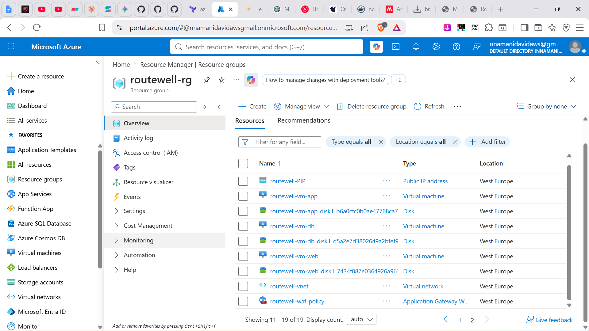
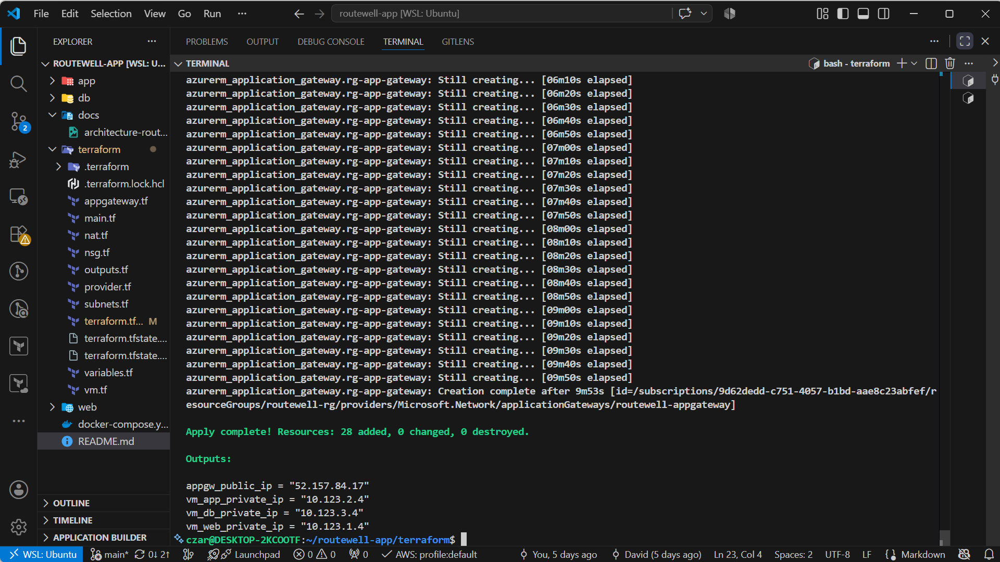
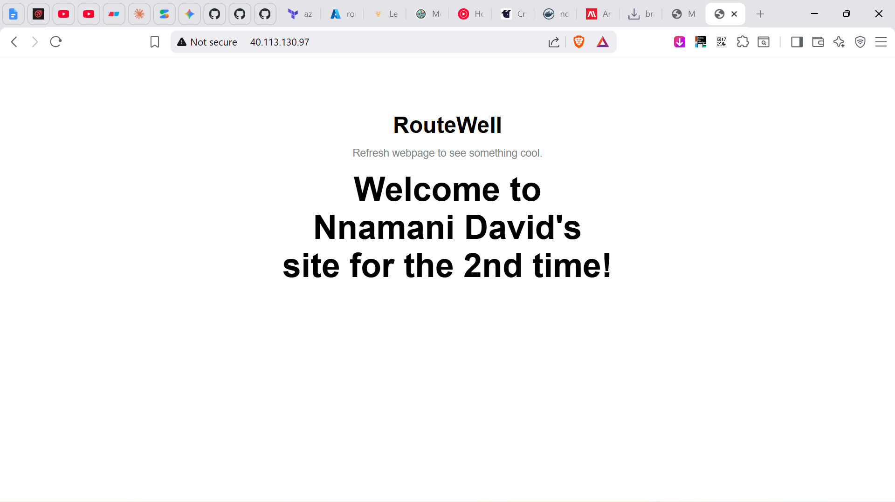
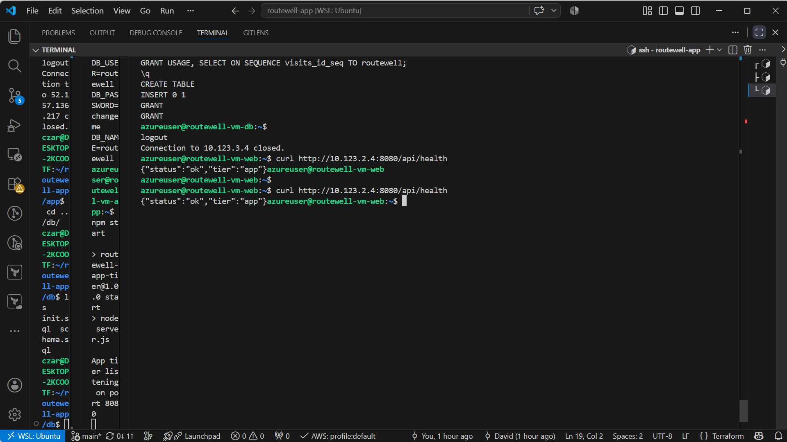
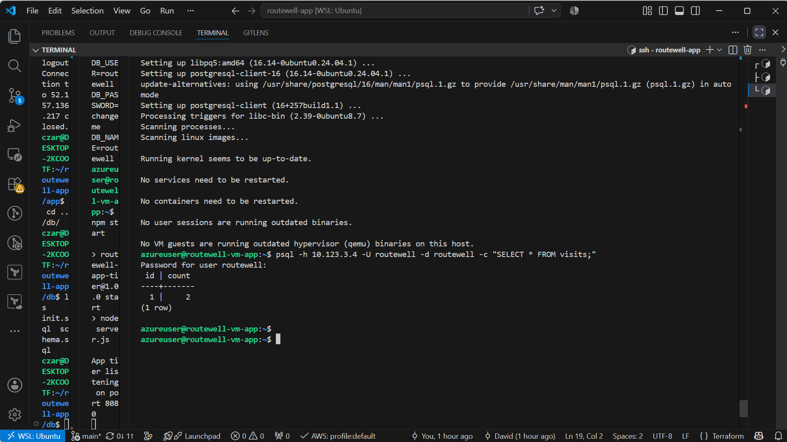
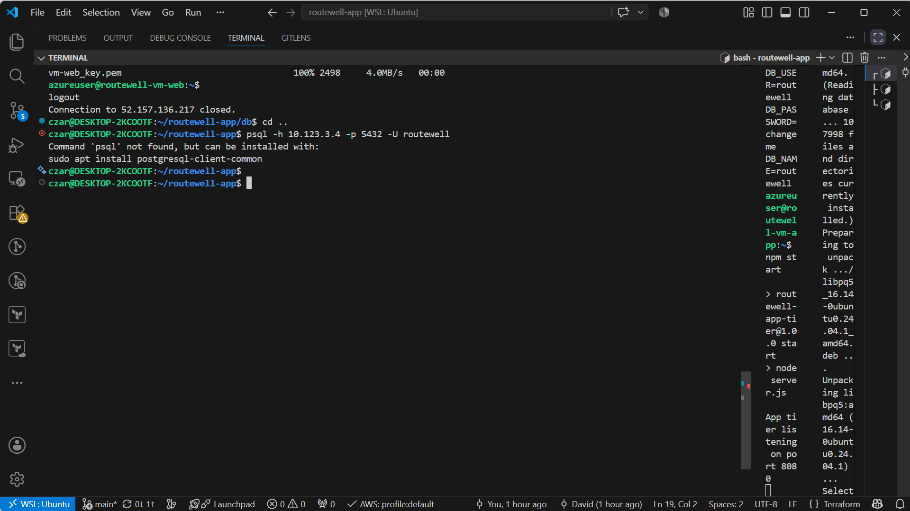
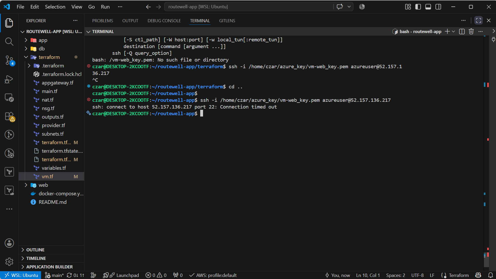

# Build Documentation

This covers the manual Azure Portal build, the Terraform automation that reproduces it, and the connectivity tests proving the design works as intended.

---

## Manual Portal build (Phase 1)

Built once by hand, in this order, to prove the design before automating it:

1. **Resource Group** — `routewell-rg`
2. **Virtual Network** — `10.123.0.0/16`, four subnets carved per the CIDR plan in [`docs/design.md`](design.md)
3. **Network Security Groups** — one per tier (`nsg-web`, `nsg-app`, `nsg-db`, `nsg-app-gw`), rules matching the justification table in [`docs/design.md` §2.2](design.md#22-nsg-rule-justification)
4. **NAT Gateway** — associated to the App and DB subnets for outbound-only internet access
5. **Application Gateway (WAF_v2)** — the public entry point, holding the only public IP in the design
6. **Three Linux VMs** — one per tier, none holding a public IP except through the temporary access path used for initial SSH setup


*All resources deployed under `routewell-rg`: VNet, four subnets, four NSGs, NAT Gateway, Application Gateway, three VMs.*

---

## Automation (Terraform)

The full environment is reproducible from a clean clone with:
```bash
cd terraform
terraform init
terraform apply
```


*`terraform apply` output showing a clean run — resources added, zero changed, zero destroyed.*

---

## Connectivity tests

Each test below was run against the Terraform-built infrastructure, not the manual build, to confirm the automation reproduces the design exactly.

### 1. Internet → Web ✅
Browser to the Application Gateway's public IP (`terraform output appgw_public_ip`) loads the dispatch app.


*Page loads successfully through the Application Gateway — the only public entry point in the design.*

### 2. Web → App ✅
From the Web VM: `curl http://<app-private-ip>:8080/api/health`


*Health check returns `{"status":"ok","tier":"app"}`, confirming Web → App connectivity over port 8080.*

### 3. App → DB ✅
From the App VM: `psql -h <db-private-ip> -U routewell -d routewell -c "SELECT * FROM visits;"`


*Query returns the `visits` row, confirming App → DB connectivity over port 5432.*

### 4. Internet → DB ❌ (blocked, as designed)
From a laptop outside the VNet: `psql -h <db-private-ip> -p 5432 -U routewell`


*Connection times out — the database subnet has no public IP and its NSG only permits traffic from the App subnet.*

### 5. Internet → Web direct ❌ (App Gateway isn't bypassable)
Attempting to reach the Web VM's private IP directly from outside the VNet.


*Fails — the Web VM holds no public IP, so all traffic must pass through the Application Gateway's WAF.*

---

## Summary

| Test | Result |
|---|---|
| Internet → Web (via App Gateway) | ✅ |
| Web → App | ✅ |
| App → DB | ✅ |
| Internet → DB | ❌ (correctly blocked) |
| Internet → Web direct (bypassing App Gateway) | ❌ (correctly blocked) |

All five results match the design intent in [`docs/design.md`](design.md): the database is never reachable from outside the App tier, and the web tier is never reachable except through the Application Gateway's WAF.